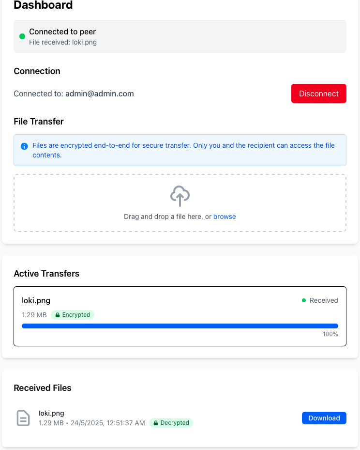

# file-mesh

A decentralized P2P file sharing application built with Go, React, and JavaScript's WebRTC API, enabling direct and end-to-end encrypted data transfer between authenticated client using WebRTC DataChannels.



## Introduction

This project was built with the motive to explore decentralized means of sharing data amongst peers, initially on a closed, homogenous network. WebRTC DataChannels enable peer-to-peer communication between devices across network hosting devices and supporting protocols of a large variety. The was coupled with AES-GCM-based end-to-end encryption to provide a safe and private means of sharing data between users, with no intervention from any central party(apart from initially introducing peers to each other).

## Features

- Decentralized peer-to-peer communication between authenticated users using *WebRTC DataChannels*
- End-to-end encryption powered by AES-GCM
- Signalling server between clients powered by WebSockets to exchange SDP messages and ICE candidates
- JWT-based authentication of users with a MongoDB database storing user data
- Seamless transfer of files up to 3 GB in size
- Can handle multiple concurrent file transfers between clients


## Getting Started

- Prerequisites
    - Go 1.20+
    - ReactJS
    - MongoDB
    - Any modern web browser that supports JavaScript's WebRTC API

- Clone the repository

```bash
git clone https://github.com/lokeshllkumar/file-mesh.git
cd file-mesh
```

- Setup the [backend server](server)

- Setup the [frontend service](frontend/file-mesh/)

- Create a profile with your Email ID and connect with another authenticated user to start sharing!

## To-Do

- [ ] - Implement a file transfer history page